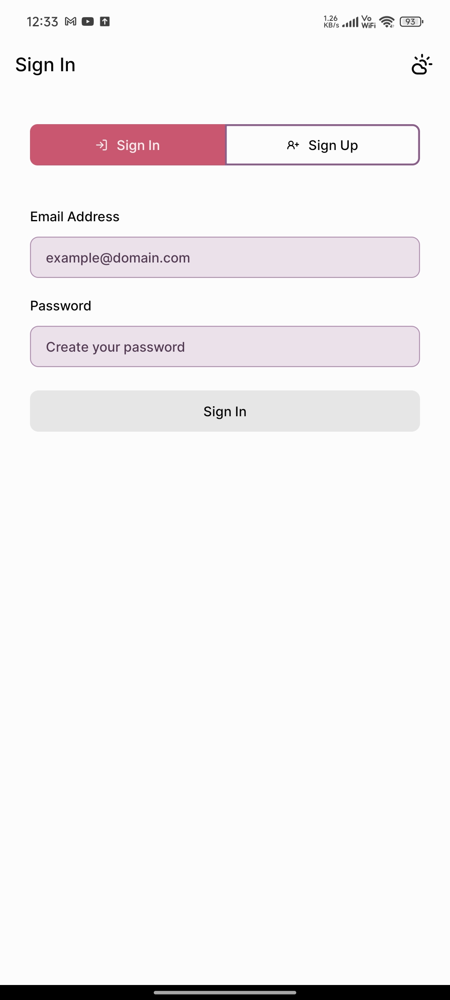
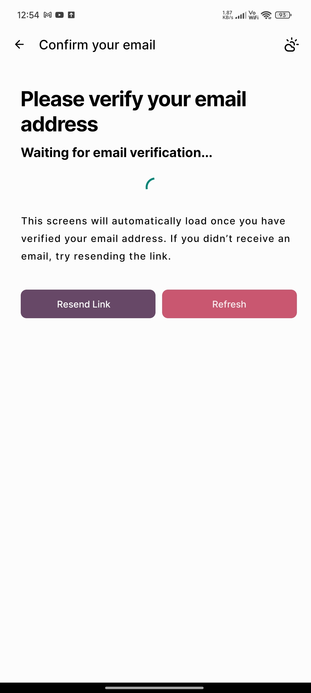
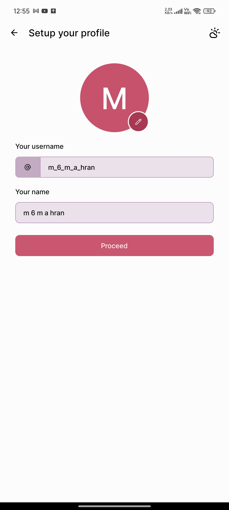
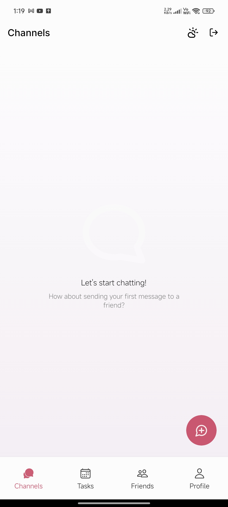
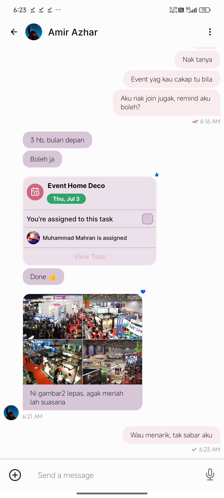
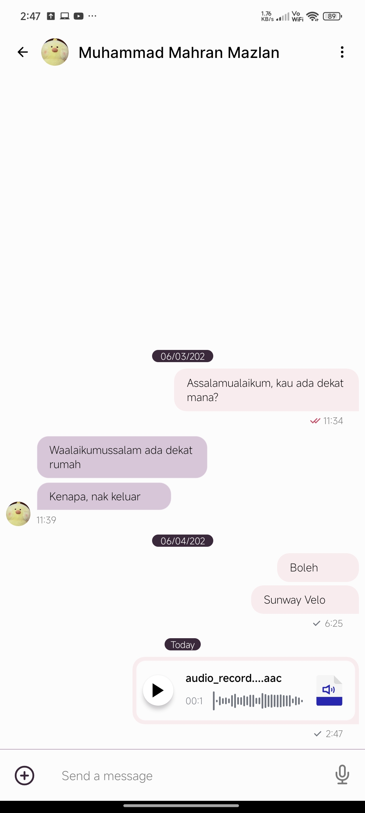
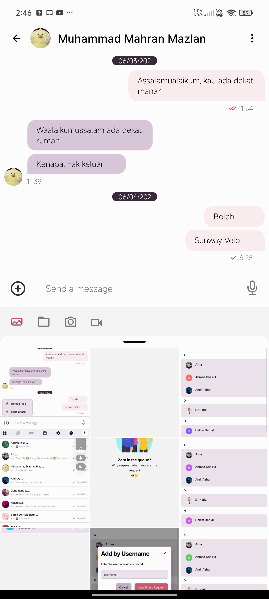
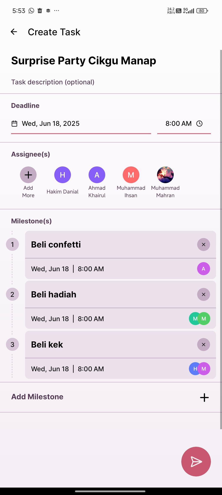
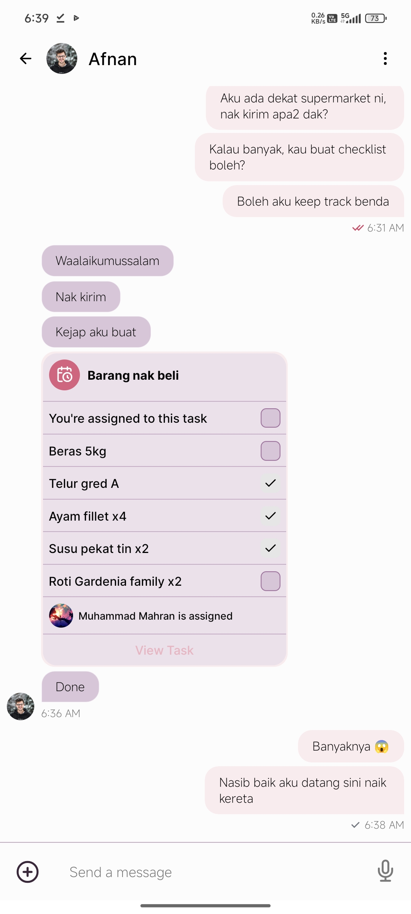
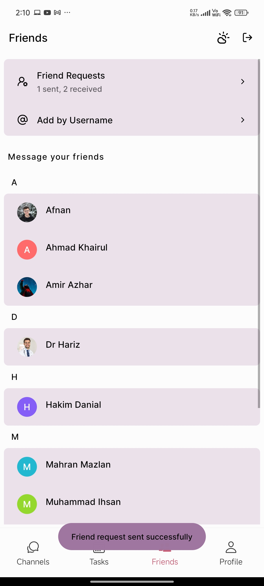

# Olign – UI & Interaction Overview

This document provides a **visual walkthrough of Olign’s user interface and interactions**. It is intended to give visitors an overview of the application **without requiring local setup or execution**.

## 🎥 Video Introduction

Want a quick preview?

▶️ **[Watch the Olign introduction on YouTube](https://youtu.be/5RNWuiwzSic)**

This video showcases Olign’s key features and overall look.

## 🔐 Authentication Flow

### Sign In & Sign Up

  

Users can either sign in or register from a single authentication screen. Form validation ensures correct input before submission.

### Email Verification

  

After registration, users must verify their email before proceeding. Verification is handled securely via Supabase and email delivery services.

### Profile Setup

  

Users configure their username, display name, and avatar before accessing the main application.

## 🏠 Core Navigation

### Home & Channels

  

The Channels tab is the default landing view, displaying all active direct and group conversations.

## 💬 Messaging Experience

### Messaging Screen

  

Messages are displayed in real time with support for text, media, tasks, and audio messages.

### Audio Messages

  

Users can record and send voice messages directly from the chat interface.

### Attachments & Media

  

Attachments such as images and files can be added seamlessly without leaving the conversation.

## ✅ Task Collaboration

### Task Creation in Chat

  

Tasks can be created directly inside conversations, with optional deadlines, assignees, and milestones.

---

### Tasks in Conversation

  

Tasks are posted into chats for visibility and collaborative tracking.

## 👥 Friends & Groups

### Friends Management

  

Users can add friends, manage requests, and build their collaboration network.

## 🎯 Purpose of This Overview

This UI overview exists to:

- Demonstrate application scope and complexity
- Showcase interaction design and UX decisions
- Allow reviewers to understand Olign without running it locally

For architectural and technical details, refer back to the main [README](./README.md).
